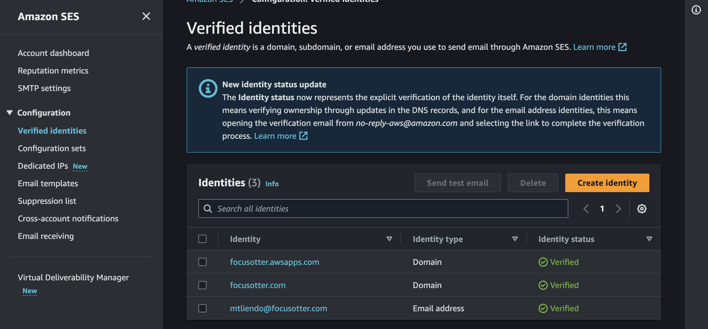

## Troubleshooting and General steps

1. Make sure the region for your SES client is correct.
2. Make sure the source and destination emails you have are verified either at the email or the domain level. If out of the sandbox, still make sure the source email is verified.



3. Link to docs: https://docs.aws.amazon.com/AWSJavaScriptSDK/v3/latest/clients/client-ses/
4. I removed the `const userAttribute = ` code since it looks like it wasn't used in place of mock data
5. Make sure the template name is correct and references a template you created
6. Make sure the `user` and `description` values in your template have fallback options in case they are undefined

From the docs:

> If your call to the SendTemplatedEmail operation includes all of the required parameters, Amazon SES accepts it and returns a Message ID. However, if Amazon SES can't render the email because the template contains errors, it doesn't send the email. Additionally, because it already accepted the message, Amazon SES doesn't return a message stating that it was unable to send the email.

Because of that, it's **highly** recommended to setup [Rendering Failure Notifications](https://docs.aws.amazon.com/ses/latest/dg/send-personalized-email-api.html) (basically setup a SNS notification to fire when things go wrong. Happy to help set this up.)

6. Make sure the values in your template [refer to the actual values](https://github.com/aws/aws-sdk-js-v3/blob/5da20841/clients/client-ses/src/models/models_0.ts#L4313-L4318) needed in your template

## How to create a template to test

ChatGPT conversation I had to help with debugging: https://chat.openai.com/share/1194fa6d-4dd0-4cbb-9a02-eea5b9ef109b

Command:

```bash
aws ses create-template --cli-input-json file://template.json
```

## How to test a template creation

Be sure to replace the email values with the actual values needed

```bash
 aws ses send-templated-email --source mtliendo@focusotter.com --destination ToAddresses=mtliendo+test@focusotter.com --template curation-request --template-data '{ "name":"Michael", "description":"Just checking in", "companyName":"Focus Otter Solutions, LLC", "link":"http://blog.focusotter.cloud" }'
```

Because the Lambda is called another AWS Service, the following must be attached:

```json
{
	"Version": "2012-10-17",
	"Statement": [
		{
			"Sid": "VisualEditor0",
			"Effect": "Allow",
			"Action": "ses:SendTemplatedEmail",
			"Resource": [
				"arn:aws:ses:*:ACT_NUMBER:identity/*",
				"arn:aws:ses:*:ACT_NUMBER:template/*"
			]
		}
	]
}
```
